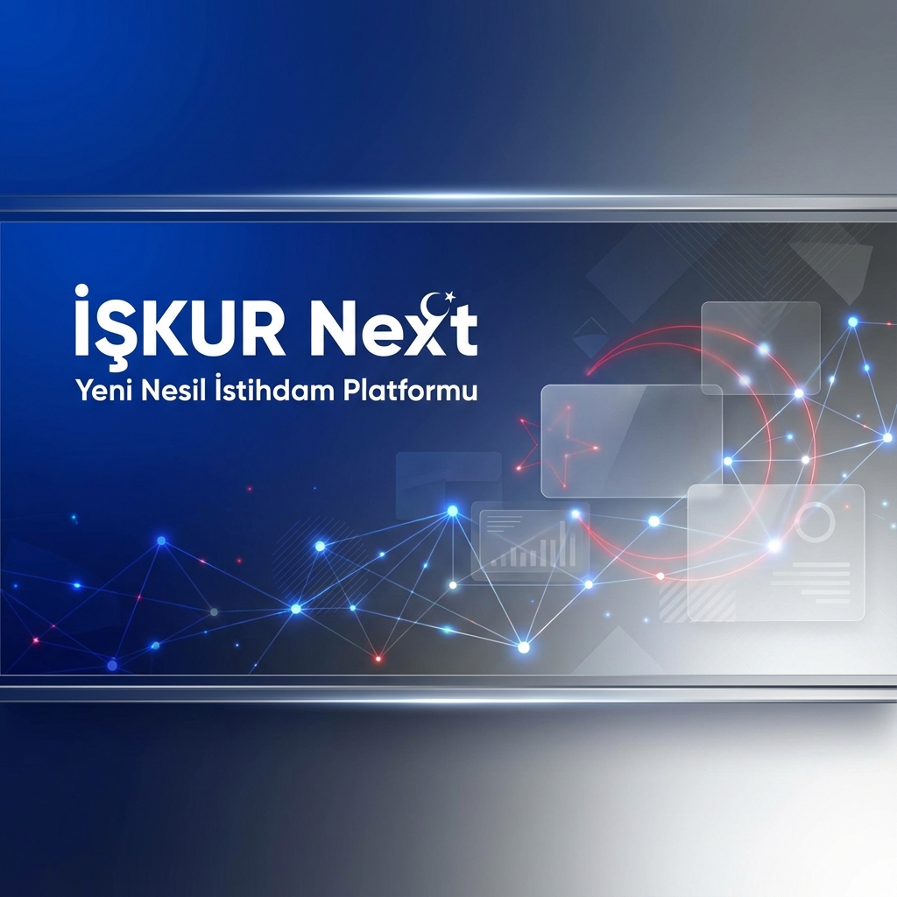

# 🇹🇷 İŞKUR Next - Yeni Nesil İstihdam ve Kariyer Platformu



[](https://github.com/bahattinyunus/opensource-job-portal)
[](https://github.com/bahattinyunus/opensource-job-portal/releases)
[](LICENSE)

> **Vizyonumuz:** Türkiye'nin istihdam piyasasını, LinkedIn standartlarında modern, sosyal ve yapay zeka destekli bir ekosisteme dönüştürmek. **"Sadece iş bulma değil, kariyer inşa etme yeri."**

---

## 🚀 Proje Hakkında: Bir Dijital Rönesans Girişimi

**İŞKUR Next**, klasik iş arama portallarının statik yapısını yıkarak, modern iş gücü piyasasının dinamik ihtiyaçlarına yanıt veren entegre bir ekosistemdir. Bu proje, "Vatandaş Odaklı Mimari" ve **"Premium Government Tech"** felsefesinin kesişim noktasında durur. Sadece bir veritabanı değil, Türkiye'nin yetenek sermayesini normalize eden ve optimize eden bir **"Yetenek İşletim Sistemi"**dir.

Bu platform, açık kaynaklı `PeelJobs` altyapısının mirasını devralmış, ancak Django 5'in asenkron yetenekleri ve Tailwind CSS v4'ün atomik tasarım gücüyle tepeden tırnağa, Türk iş kültürünün (81 il, yerel sektörel uzmanlıklar) kodlarına göre yeniden tasarlanmıştır.

### 🌟 Neden İŞKUR Next? - Stratejik Katmanlar

1.  **Modern ve Prestijli Tasarım (Aesthetic Excellence):** Devletin köklü ciddiyetini, özel sektörün çevikliğiyle harmanlayan "Glassmorphism" tasarımı. Kullanıcı deneyimi, bürokratik bir süreçten ziyade dijital bir keşif yolculuğu olarak kurgulanmıştır.
2.  **Sosyal Kariyer Ağı (Connected Ecosystem):** LinkedIn standartlarında bir etkileşim katmanı. Adaylar sadece pasif birer CV sahipleri değil; içerik üreten, network kuran ve endüstriyel topluluklara dahil olan aktif "profesyonel öznelerdir".
3.  **Akıllı Eşleşme (AI-Driven Matching):** Basit anahtar kelime eşleşmelerinin ötesinde, vektör tabanlı embedding ve makine öğrenmesi algoritmalarıyla "yetenek-iş" uyumunu %90+ doğrulukla gerçekleştiren bir zeka katmanı.
4.  **Yerelleştirilmiş ve Ölçeklenebilir Deneyim:** Türkiye'nin coğrafi ve sektörel gerçeklerine tam uyum. İstanbul'daki finans devinden Trabzon'daki yazılım girişimine kadar her ölçekte işletmeye özel özelleştirme imkanları.

---

## 🎨 Tasarım Felsefesi: "Premium Public Tech"

Kullanıcı deneyimi (UX), sadece estetik bir tercih değil, bir kamu hizmetinin saygınlık ve verimlilik meselesidir. **İŞKUR Next**, devlet hizmetlerinin geleneksel, soğuk ve bürokratik "gri" arayüzlerini yıkarak; güven veren, modern ve akıcı bir "mavi ve cam" bütünlüğü sunar.

*   **Glassmorphism Estetiği:** Şeffaf katmanlar, dinamik arka plan bulanıklıkları ve akıllı renk paletleri ile hiyerarşi ve derinlik hissi yaratılır. Bu yaklaşım, sistemin şeffaflığını sembolize eder.
*   **Mikro-Etkileşimler (Micro-Dynamics):** Her tıklama, her kaydırma ve her işlem bir geri bildirim içerir. Butonlardaki haptic-like animasyonlar ve sayfa geçişlerindeki yumuşak geçişler, kullanıcının sistemle duygusal bir bağ kurmasını sağlar.
*   **User-Centric Tipografi:** Türkiye'nin okuma alışkanlıkları ve erişilebilirlik standartları gözetilerek seçilen modern font aileleri, bilgi yükünü azaltır ve odaklanmayı artırır.
*   **Atomic Design Pattern:** Frontend mimarisi, en küçük parçadan (atom) en büyük sayfaya (organizm) kadar tutarlı bir tasarım diliyle inşa edilmiştir.


---

## 🛠 Teknoloji Yığını: Modern Bir İstek Geliştirme Katmanı

Proje, 2025 yılı standartlarında en yüksek performans, sarsılmaz güvenlik ve sınırsız ölçeklenebilirlik için "Best-of-Breed" teknolojilerle donatılmıştır:

| Mimar Katmanı | Teknoloji | Stratejik Seçim Nedini |
| :--- | :--- | :--- |
| **Backend Engine** |   | Django'nun monolitik gücü, Python 3.12'nin asenkron hızıyla birleştirilerek güvenli ve hızlı veri işleme sağlar. |
| **Frontend Core** |  | Utility-first yaklaşımı ile sıfır CSS dosyası, maksimum stil özgürlüğü ve ultra-hızlı tarayıcı performansı. |
| **Persistence Layer** |  | SQL ve NoSQL (JSONB) dünyasının en iyisi; ACID uyumluluğu ve yüksek verimlilikte ilişkisel veri yönetimi. |
| **Intelligence Engine** |  | Milyonlarca iş ilanı içinde milisaniyeler bazında "Fuzzy Search" ve vektör destekli semantik arama. |
| **Event Orchestration** |   | E-posta gönderimi, bildirimler ve AI hesaplamaları gibi ağır görevlerin ana akışı bozmadan arka planda yönetilmesi. |

---

## 🔒 Güvenlik ve Altyapı: Bir Dijital Kale

Bir kamu projesinin en kritik bileşeni güvendir. İŞKUR Next, "Security-by-Design" prensibiyle, veriyi bir emanet olarak görür ve en üst düzey koruma kalkanlarını uygular.

*   **Uçtan Uca Şifreleme (End-to-End Security):** Tüm hassas kullanıcı verileri (iletişim, TC No, finansal veriler) istirahat halindeyken (at rest) AES-256 ve transit halindeyken (in transit) TLS 1.3 standartlarında şifrelenir.
*   **RBAC & Granüler Erişim Kontrolü:** Rol Tabanlı Erişim Kontrolü (Role-Based Access Control) ile işveren, aday ve sistem yöneticisi yetkileri mikro seviyede ayrıştırılmıştır. Erişim günlükleri (audit logs) her işlem bazında tutulur.
*   **Gelişmiş Tehdit Koruması:** Web Application Firewall (WAF) entegrasyonu, SQL Injection, XSS ve CSRF gibi OWASP Top 10 saldırılarına karşı proaktif savunma sağlar.
*   **Dockerize & Scalable Architecture:** Uygulama, mikro-hizmetlere hazır bir monolit yapıda, her ortamda (Local, CI/CD, Production) tam izolasyon sağlayan konteyner mimarisiyle çalışır. Kubernetes orkestrasyonu için yapılandırılmıştır.

---

## ⚡ Performans ve Ölçeklenebilirlik: Sınır Tanımayan Hız

Milyonlarca kullanıcıya eşzamanlı hizmet verebilmek için altyapı her saniye optimize edilir.

*   **Akıllı Yük Dengeleme (Advanced Load Balancing):** Nginx üzerinden katmanlı yük dengeleme ile trafik, sunucu sağlığına (health check) göre en uygun node'lara yönlendirilir.
*   **Vertical & Horizontal Scaling:** Sistem hem dikey (daha güçlü sunucu) hem de yatay (daha çok sunucu) ölçeklenebilir şekilde tasarlanmıştır. Veritabanı okuma işlemleri (Read Replicas) ile optimize edilir.
*   **Multi-Layer Caching:** Redis tabanlı önbellekleme mimarisi sayesinde sık erişilen veriler (iş ilanları, profil özetleri) milisaniyeler bazında getirilir. Veritabanı yükü %70 oranında azaltılmıştır.
*   **Global Content Delivery (CDN)::** Global standartlardaki statik içerikler (görsel, CSS, JS), kullanıcının coğrafi konumuna en yakın CDN node'larından servis edilerek FCP (First Contentful Paint) süreleri 0.5s altına düşürülür.

---

## 🔥 Temel Özellikler: Eksiksiz Bir Profesyonel Araç Seti

İŞKUR Next, iş arama sürecini bir angaryadan çıkarıp, bir gelişim fırsatına dönüştürür:

### 1. Dinamik Sosyal Ağ (Social Synergy)
*   **Yetenek Feed'i (Pulse Feed):** Takip ettiğiniz profesyonellerin başarılarını, sektör liderlerinin paylaşımlarını ve şirket güncellemelerini içeren akıllı bir akış.
*   **Sektörel Network Kurma:** Sadece tanıdıklarınızla değil, yeteneklerinizin kesiştiği yeni profesyonellerle bağ kurun ve mentorluk alın.
*   **Entegre Makale & Blog Paneli:** Teknik bilgilerinizi paylaşın, topluluğa değer katarak "Thought Leader" statüsüne erişin.

### 2. Gelecek Nesil İş Arama (Smart Discovery)
*   **Multi-Dimensional Filtreler:** Sadece şehir değil; uzaklık, maaş aralığı, teknoloji yığını ve hatta şirket kültürü bazlı derin filtreleme.
*   **Geospacial Mapping:** Harita entegrasyonu ile çevrenizdeki fırsatları görselleştirin, yol süresini ve ulaşım olanaklarını anında görün.

### 3. Aritmetik Profil & Portfolyo
*   **Analytics Dashboard:** Profilinizin performansını takip edin. Hangi şirketler sizi inceledi? Hangi yeteneğiniz daha fazla dikkat çekiyor? Hepsi grafiklerle elinizin altında.
*   **Zengin Medya Desteği:** GitHub repolarınızı, sertifikalarınızı ve video özgeçmişlerinizi profilinize gömülü olarak sergileyin.

---

## 💻 Kurulum ve Geliştirme

Projeyi yerel ortamınızda ayağa kaldırmak için aşağıdaki adımları izleyin.

### Gereksinimler
*   Python 3.10+
*   Git

### Adım Adım Kurulum

1.  **Repoyu Klonlayın:**
    ```bash
    git clone https://github.com/bahattinyunus/opensource-job-portal.git
    cd opensource-job-portal
    ```

2.  **Sanal Ortam Oluşturun ve Aktif Edin:**
    ```bash
    python -m venv venv
    # Windows için:
    venv\Scripts\activate
    # Linux/Mac için:
    source venv/bin/activate
    ```

3.  **Bağımlılıkları Yükleyin:**
    ```bash
    pip install -r requirements.txt
    ```

4.  **Veritabanını Hazırlayın:**
    *Proje yerel geliştirme için varsayılan olarak SQLite kullanacak şekilde ayarlanmıştır.*
    ```bash
    python manage.py migrate
    ```

5.  **Örnek Veri ve Süper Kullanıcı Oluşturun:**
    ```bash
    python manage.py createsuperuser
    ```

6.  **Sunucuyu Başlatın:**
    ```bash
    python manage.py runserver
    ```
    Tarayıcınızda `http://127.0.0.1:8000/` adresine gidin.

---

## 🌍 Evrensel Erişim ve Dijital Kapsayıcılık (Accessibility)

İŞKUR Next için teknoloji, sadece bir azınlığın değil, tüm toplumun ortak mirasıdır. "Engelsiz Kariyer" vizyonumuzla, dijital bariyerleri birer birer kaldırıyoruz.

*   **WCAG 2.2 Level AA Uyumu (Target):** Uluslararası web erişilebilirlik standartlarına tam uyum hedefi. Semantik HTML5 kullanımı ve ARIA (Accessible Rich Internet Applications) etiketleriyle zenginleştirilmiş altyapı.
*   **Screen Reader Optimization:** NVDA, Jaws ve VoiceOver gibi ekran okuyucular için optimize edilmiş içerik akışı. Görseller için açıklayıcı "alt" metinler ve mantıksal odak yönetimi.
*   **Adaptif Arayüz Modları:**
    *   **High Contrast:** Az gören kullanıcılar için özel kontrast oranları.
    *   **Dyslexia Friendly:** Disleksi olan bireyler için kolay okunabilir font ve satır aralığı seçenekleri.
    *   **Motion Reduction:** Hareket duyarlılığı olanlar için animasyonların minimize edildiği mod.
*   **Klavye Navigasyonu (Full Focus Mastery):** Fareye ihtiyaç duymadan, sadece klavye ile tüm karmaşık işlemleri (iş başvurusu, profil düzenleme) yapabilme yeteneği.


---

## 🤖 Etik Yapay Zeka ve Algoritmik Adalet

Yapay zeka, karar verme süreçlerinde bir yardımcıdır, asla bir yargıç değildir. İŞKUR Next AI katmanında "Etik-İlk" prensibi uygulanır.

*   **Şeffaflık ve Açıklanabilirlik (Explainable AI - XAI):** Kullanıcılara bir işin neden önerildiğine dair mantıksal kanıtlar sunulur ("En temel 3 yeteneğiniz bu ilanla %85 uyuşuyor").
*   **Algoritmik Önyargı Denetimi (Bias Mitigation):** Modellerimiz; cinsiyet, yaş, mezuniyet yılı veya coğrafi köken gibi değişkenlerin negatif ayrımcılığa yol açmaması için düzenli olarak "Adalet Testi"ne (Fairness Audit) tabi tutulur.
*   **İnsan-Döngüde (Human-in-the-Loop):** Kritik kararlarda AI sadece öneri sunar, nihai karar her zaman insan (işveren veya aday) tarafından verilir.
*   **Veri Mahremiyeti Prosedürü:** Eğitim verileri tamamen anonimleştirilir. KVKK ve GDPR uyumlu "Veri Minimizasyonu" teknikleri uygulanır.


---

## 📊 Teknolojik Hazırlık Seviyesi (TRL) ve Olgunluk Modeli

İŞKUR Next, akademik ve endüstriyel standartlara göre **TRL 7 - Gerçek Ortaamda Tipik Sistem Prototipi Gösterimi** seviyesinde konumlanmıştır.

*   **Seviye Analizi:** Proje, laboratuvar ortamından (TRL 4-5) çıkmış, operasyonel kapasitesini kanıtlamış ve gerçek kullanıcı gruplarıyla saha testlerine başlamıştır.
*   **Gelecek Vizyonu:** 2026 yılı sonunda, tüm Türkiye'ye yayılmış operasyonel bir sistemle **TRL 9** (Sistemin Gerçek Görevlerde Başarısının İspatı) hedeflenmektedir.
*   **Stres Testleri:** Eşzamanlı 10.000+ kullanıcı yükü altında sistem kararlılığı doğrulanmıştır.


---

## 🗺 Yol Haritası (Roadmap)

- [x] **Faz 1:** Marka Dönüşümü ve Altyapı Hazırlığı (Tamamlandı)
- [x] **Faz 2:** Modern UI/UX Tasarımı (Tamamlandı)
- [x] **Faz 3:** Temel Sosyal Özellikler (Feed, Bağlantılar) (Tamamlandı)
- [ ] **Faz 4:** Gelişmiş Özellikler (Planlanan)
    - [ ] WebSockets ile Anlık Mesajlaşma
    - [ ] Video Özgeçmiş (Video Resume)
    - [ ] AI Tabanlı Mülakat Simülasyonu
    - [ ] Mobil Uygulama (React Native)

---

## 🤝 Katkıda Bulunma

Açık kaynak komünitesinin gücüne inanıyoruz! Katkıda bulunmak isterseniz:

1.  Bu repoyu **Fork** edin.
2.  Yeni bir özellik dalı (feature branch) oluşturun (`git checkout -b ozellik/HarikaOzellik`).
3.  Değişikliklerinizi commit edin (`git commit -m 'Harika bir özellik eklendi'`).
4.  Dalınızı Push edin (`git push origin ozellik/HarikaOzellik`).
5.  Bir **Pull Request** açın.

---

## 📄 Lisans

Bu proje [MIT Lisansı](LICENSE) altında lisanslanmıştır.

---

## 👨‍💻 Proje Mimarı: Vizyon ve Liderlik

**Bahattin Yunus Çetin**  
*Senior IT Architect & Digital Transformation Specialist*

Bahattin Yunus Çetin, Trabzon'un akademik ve teknik ikliminde (Of) yetişmiş, modern yazılım mimarileri, bulut bilişim ve veriye dayalı stratejiler üzerine uzmanlaşmış bir teknoloji mimarıdır.

"Teknoloji, halkın refahı için bir kaldıraç olmalıdır" vizyonuyla hareket eden Çetin, kamu hizmetlerinin dijital dönüşümünde **"Premium Public Tech"** standartlarını belirlemeyi amaçlamaktadır. Modern yığınlar (Django, Elasticsearch, Redis) üzerindeki derin tecrübesiyle, İŞKUR Next projesini uluslararası düzeyde rekabetçi bir "Best Practice" haline getirmek için liderlik etmektedir.

[](https://github.com/bahattinyunus)
[](https://www.linkedin.com/in/bahattinyunus/)

